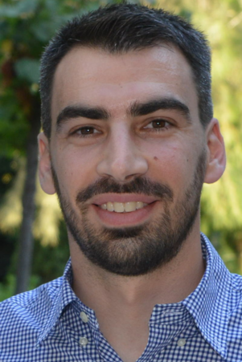

## Description

Data scientists today search large data lakes to discover and integrate datasets. In order to bring together disparate data sources, dataset discovery methods rely on some form of schema matching: the process of establishing correspondences between datasets. Traditionally, schema matching has been used to find matching pairs of columns between a source and a target schema. However, the use of schema matching in dataset discovery methods differs from its original use. Nowadays schema matching serves as a building block for indicating and ranking inter-dataset relationships. Surprisingly, although a discovery method’s success relies highly on the quality of the underlying matching algorithms, the latest discovery methods employ existing schema matching algorithms in an ad-hoc fashion due to the lack of openly-available datasets with ground truth, reference method implementations, and evaluation metrics.

We aim to rectify the problem of evaluating the effectiveness and efficiency of schema matching methods for the specific needs of dataset discovery. To this end, we propose ***Valentine***, an extensible open-source experiment suite to execute and organize large-scale automated matching experiments on tabular data. Valentine includes implementations of seminal schema matching methods that we either implemented from scratch (due to absence of open source code) or imported from open repositories. The contributions of Valentine are: *i)* the definition of four schema matching scenarios as encountered in dataset discovery methods, *ii)* a principled dataset fabrication process tailored to the scope of dataset discovery methods and *iii)* the most comprehensive evaluation of schema matching techniques to date, offering insight on the strengths and weaknesses of existing techniques, that can serve as a guide for employing schema matching in future dataset discovery methods.

## Authors

<figure class="item" style="vertical-align:top; display: inline-block; text-align:center; width:80px">
    <a href="https://ckoutras.github.io/"></a>
    <figcaption class="caption" style="display:block">C. Koutras TU Delft</figcaption>
</figure>

<figure class="item" style="vertical-align:top; display: inline-block; text-align:center; width:85px">
    <a href="https://www.tudelft.nl/ewi/over-de-faculteit/afdelingen/software-technology/web-information-systems/people/georgios-siachamis/"></a>
    <figcaption class="caption" style="display:block">G.  Siachamis TUDelft</figcaption>
</figure>

<figure class="item" style="vertical-align:top; display: inline-block; text-align:center; width:80px">
   <a href="https://andraionescu.github.io/"></a>
    <figcaption class="caption" style="display:block">A. Ionescu TU Delft</figcaption>
</figure>

<figure class="item" style="vertical-align:top; display: inline-block; text-align:center; width:80px">
    
    <figcaption class="caption" style="display:block">K. Psarakis TU Delft</figcaption>
</figure>

<figure class="item" style="vertical-align:top; display: inline-block; text-align:center; width:80px">
    
    <figcaption class="caption" style="display:block">J. Brons ING</figcaption>
</figure>

<figure class="item" style="vertical-align:top; display: inline-block; text-align:center; width:85px">
    <a href="http://mariosfragkoulis.gr/"></a>
    <figcaption class="caption" style="display:block">M. Fragkoulis TU Delft</figcaption>
</figure>

<figure class="item" style="vertical-align:top; display: inline-block; text-align:center; width:80px">
    <a href="https://www.tudelft.nl/ewi/over-de-faculteit/afdelingen/software-technology/web-information-systems/people/christoph-lofi/"></a>
    <figcaption class="caption" style="display:block">C. Lofi <br>TU Delft</figcaption>
</figure>

<figure class="item" style="vertical-align:top; display: inline-block; text-align:center; width:80px">
    <a href="https://perso.liris.cnrs.fr/angela.bonifati/"></a>    <figcaption class="caption" style="display:block">A. Bonifati Lyon 1 University</figcaption>
</figure>

<figure class="item" style="vertical-align:top; display: inline-block; text-align:center; width:100px">
    <a href="http://asterios.katsifodimos.com/"></a>
    <figcaption class="caption" style="display:block">A. Katsifodimos TU Delft</figcaption>
</figure>


## Repositories

- <https://github.com/delftdata/valentine> : Main repository containing the Valentine framework source code.
- <https://github.com/delftdata/valentine-generator> : Contains the source code of the dataset generator of Valentine.
- <https://github.com/delftdata/valentine-paper-results> : Contains detailed experimental results and plots based on the paper's evaluation.
- All dataset pairs used in Valentine can be found [here](https://surfdrive.surf.nl/files/index.php/s/QU5oxyNMuVguEku)

## Valentine Paper
- [[arXiV]()] Valentine: Evaluating Matching Techniques for Dataset Discovery 

## Cite Valentine

```
@article{}

```

